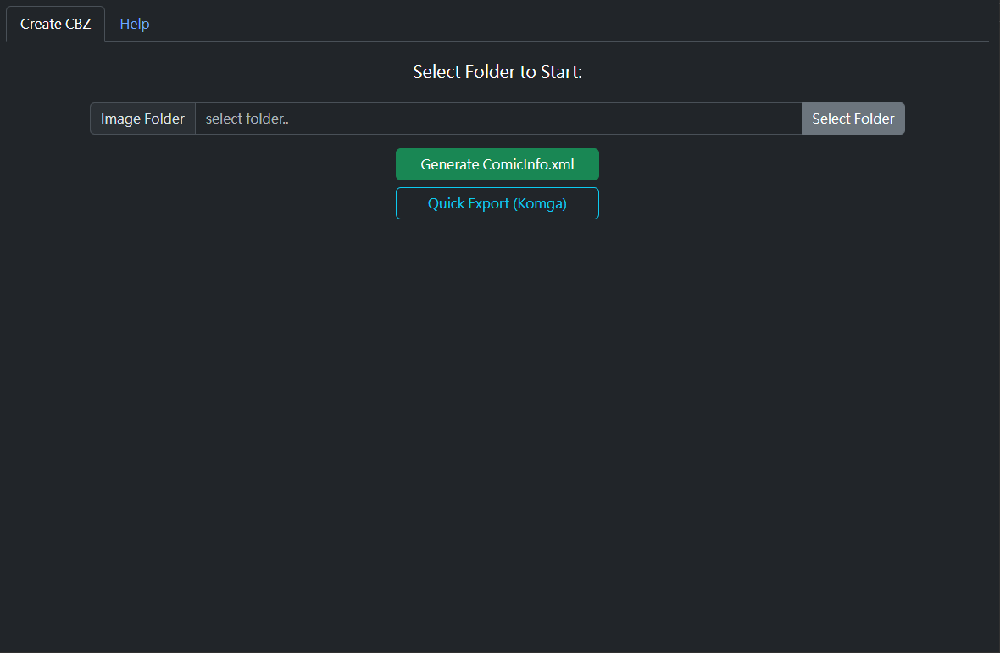
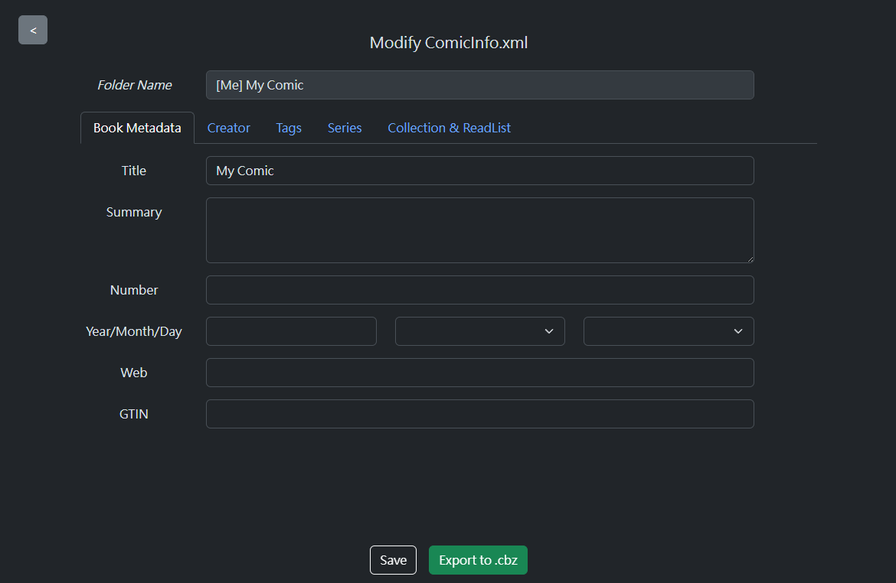
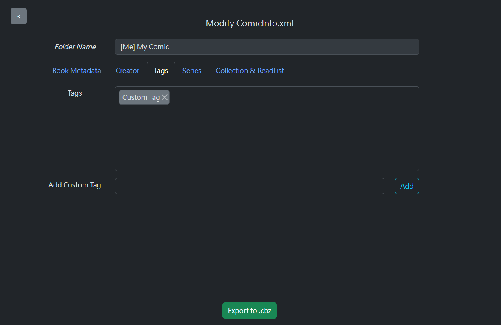
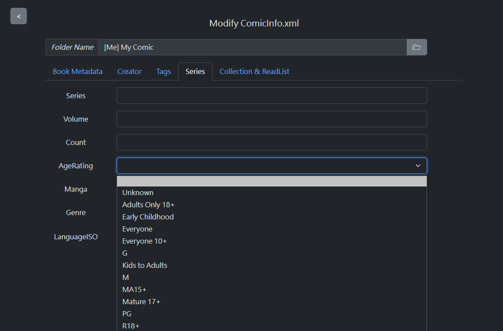

# ComicInfo Parser

A simple GUI for create `ComicInfo.xml` and `.cbz` archive at easy way.

## About

[ComicInfo.xml](https://anansi-project.github.io/docs/comicinfo/documentation) is a metadata for manga/comic. It is used in some self-hosted app, e.g. `komga`.

## Feature Available

### Preview generated ComicInfo

After select folder for generate `ComicInfo.xml`, a preview page will appear. User can change content before export real `ComicInfo.xml`.

When there has existing `ComicInfo.xml` file in selected folder, GUI will load existing `ComicInfo.xml` data instead of create a new one.

Currently, this project supports fields:

-   `Title`, `Number`, `Summary`, `Year/Month/Day`, `Web`, `GTIN`
-   ALL Creator fields: `Writer`, `Translator` .etc
-   `Tags` with GUI to edit & view
-   `Series`, `Volume`, `Count`
-   `AgeRating`, `Manga` with Enum values supported
-   `Genre`, `LanguageISO`
-   `SeriesGroup`, `AlternateSeries`
-   `AlternateNumber`, `AlternateCount`
-   `StoryArc`, `StoryArcNumber`

### Option to Export ComicInfo

After preview & press button to export, User can defined export folder, and export in following options:

-   `.cbz` with `komga` folder structure
-   `.cbz` file ONLY
-   `ComicInfo.xml` ONLY

### Quick Export (Komga Only)

Ignore preview section and generate `.cbz` with `komga` folder structure directly.

Already contains a `.cbz` archive and `ComicInfo.xml` at `{selected-folder}/{comic-title}` location, while export location can NOT be changed.

User can directly copy exported folder to `komga` comic directory.

## Screenshots

|  |  |
| ---------------------------------------- | ------------------------------------------- |
|    |  |
|         |                                             |
