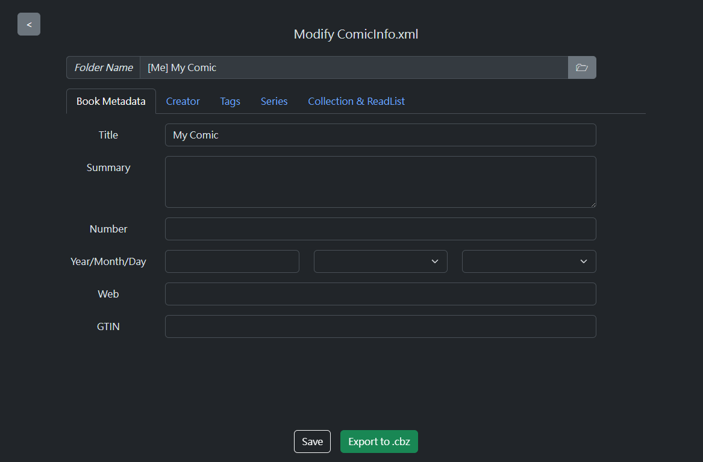
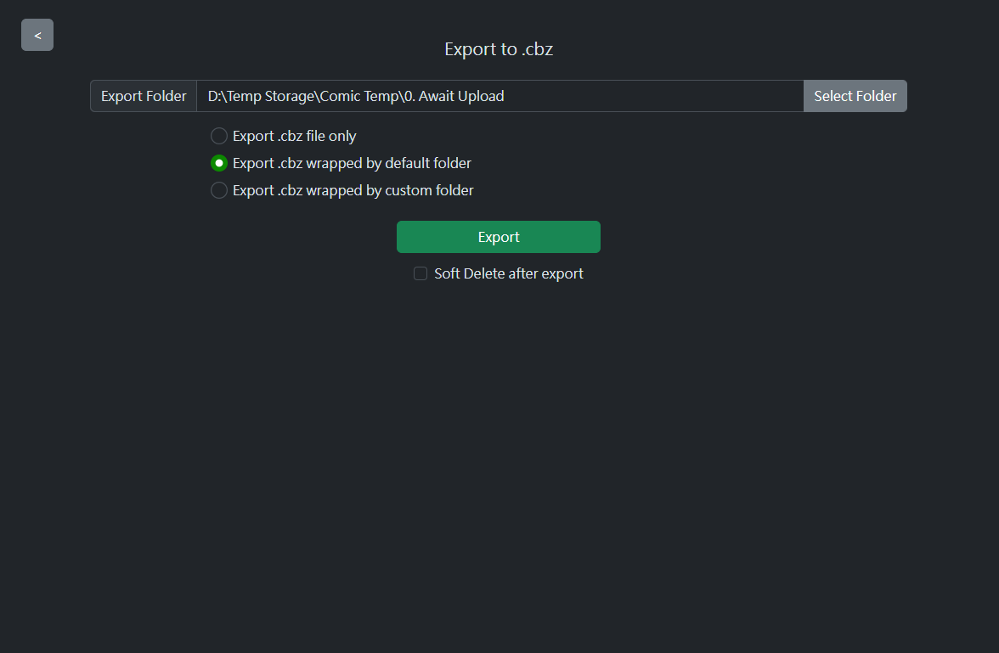

# ComicInfo Parser

A simple GUI for create `ComicInfo.xml` and `.cbz` archive at easy way.

## About

[ComicInfo.xml](https://anansi-project.github.io/docs/comicinfo/documentation) is a metadata for manga/comic. It is used in some self-hosted app, e.g. `komga`.

## Feature Available

### Preview generated ComicInfo

After select folder for generate `ComicInfo.xml`, a preview page will appear. User can change content before export real `ComicInfo.xml`.

When there has existing `ComicInfo.xml` file in selected folder, GUI will load existing `ComicInfo.xml` data instead of create a new one.

Currently, this project supports fields:

-   `Title`, `Number`, `Summary`, `Year/Month/Day`, `Web`, `GTIN`
-   ALL Creator fields: `Writer`, `Translator` .etc
-   `Tags` with GUI to edit & view
-   `Series`, `Volume`, `Count`
-   `AgeRating`, `Manga` with Enum values supported
-   `Genre`, `LanguageISO`
-   `SeriesGroup`, `AlternateSeries`
-   `AlternateNumber`, `AlternateCount`
-   `StoryArc`, `StoryArcNumber`

|     |  |
| ------------------------------------------- | ------------------------------------------- |
|  |       |

By "Save" button, you can generate `ComicInfo.xml` file in selected folder automatically.

### Use inputted values

Every timer user export comicinfo, the input value will be save to local database file automatically.

User can use these values when they generate another comicinfo, with easy-to-use GUI.

Currently, this feature support below fields:

-   `Genre`
-   `Publisher`
-   `Tags`

More field will be added in near future.

### Option to Export ComicInfo

After preview & press button to export, User can defined export folder, and export in following options:

-   `.cbz` with `komga` folder structure
-   `.cbz` file ONLY

### Quick Export (Komga Only)

Ignore preview section and generate `.cbz` with `komga` folder structure directly.

Already contains a `.cbz` archive and `ComicInfo.xml` at `{selected-folder}/{comic-title}` location, while export location can NOT be changed.

User can directly copy exported folder to `komga` comic directory.

## Data

All data will be stored in sqlite3 database, which located at `{Home Directory}/comicInfo-parser/storage.db`.

### Backup

When database schema upgrade (e.g. v1 -> v2), a auto backup will be created in `{Home Directory}/comicInfo-parser/backup` folder.

### Important Notes on Downgrade Migration Scripts

Please be aware that all downgrade scripts are not guaranteed to have correct & complete data due to:

-   Unsupported Values: Some values may not be compatible with the older schema.
-   Corrupted Data: Corrupted values may fail to convert properly during the downgrade process.

All downgrade scripts are intended for developer use only, and should not be used by end-users.

Developer should always ensure backup are taken before executing any downgrade operations.
