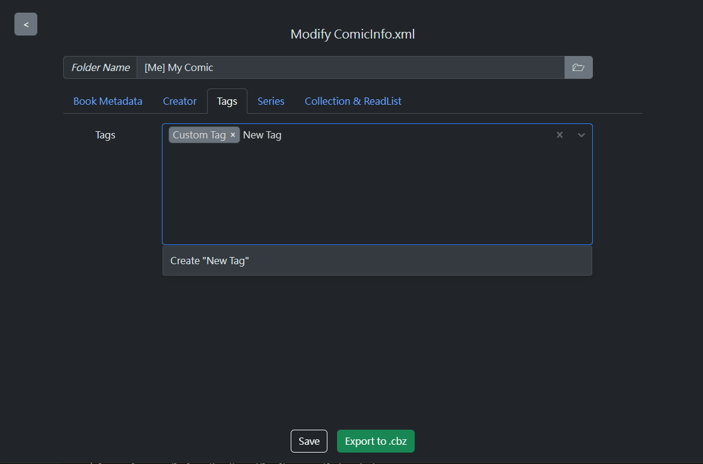
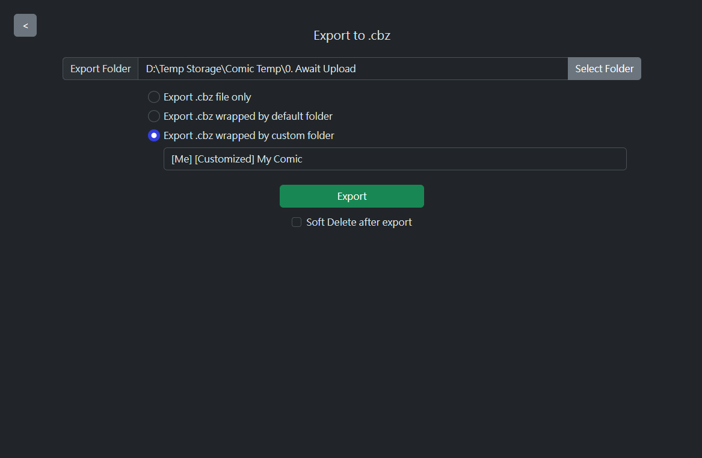

# ComicInfo Parser

A simple GUI for create `ComicInfo.xml` and `.cbz` archive at easy way.

## About

[ComicInfo.xml](https://anansi-project.github.io/docs/comicinfo/documentation) is a metadata for manga/comic. It is used in some self-hosted app, e.g. `komga`.

## Feature Available

### Preview generated ComicInfo

After select folder for generate `ComicInfo.xml`, a preview page will appear. User can change content before export real `ComicInfo.xml`.

When there has existing `ComicInfo.xml` file in selected folder, GUI will load existing `ComicInfo.xml` data instead of create a new one.

Currently, this project supports fields:

-   `Title`, `Number`, `Summary`, `Year/Month/Day`, `Web`, `GTIN`
-   ALL Creator fields: `Writer`, `Translator` .etc
-   `Tags` with GUI to edit & view
-   `Series`, `Volume`, `Count`
-   `AgeRating`, `Manga` with Enum values supported
-   `Genre`, `LanguageISO`
-   `SeriesGroup`, `AlternateSeries`
-   `AlternateNumber`, `AlternateCount`
-   `StoryArc`, `StoryArcNumber`

|     |  |
| ------------------------------------------- | ------------------------------------------- |
|  |       |

By "Save" button, you can generate `ComicInfo.xml` file in selected folder automatically.

### Use inputted values

Every timer user export comicinfo, the input value will be save to local database file automatically.

User can use these values when they generate another comicinfo, with easy-to-use GUI.

Currently, this feature support below fields:

-   `Genre`
-   `Publisher`
-   `Tags`

More field will be added in near future.


### Auto fill values

Each time when generate comicinfo file, program will try to auto fill some values depends on folder name of selected folder.

Folder name will be split to some keywords by space characters, and only fill value when keywords is same with inputted values in local database .

Currently, this feature support below fields:

-   `Genre`
-   `Publisher`
-   `Tags`

More field will be added in near future.

### Option to Export ComicInfo

After preview & press button to export, User can defined export folder, and export in following options:

-   `.cbz` file ONLY
-   `.cbz` with `komga` folder structure, using book name as folder name
-   `.cbz` with `komga` folder structure, using custom folder name

|  |  |
| ------------------------------------ | ----------------------------------------------- |

#### Soft Delete after export

If user has configured a trash bin (specified for this program), then they can tick "Soft delete after export" option.

This option will move current working comic folder to user defined trash bin when a successful export process completed.

### Quick Export (Komga Only)

Ignore preview section and generate `.cbz` with `komga` folder structure directly.

Default export location is inside selected folder. Export location can be changed by configuration ONLY.

The file structure will be:

```
{export-folder OR selected folder}/
├─ {comic-title}/
│  ├─ {comic-title}.cbz
│  │  ├─ {...images file}
│  │  ├─ ComicInfo.xml
```

User can directly copy `{comic-title}/` folder to `komga` comic directory.

## Configuration

This program support some customizations by `.yaml` file configuration.

Your configuration file should like:

```
your-folder/
├─ ComicInfo-Parser.exe
├─ config.yaml
```

If no configuration is found, program will NOT create for yourself. Instead, it will use its default behavior.

You may found a sample of configuration file in `config-example.yaml`, and default values in `config-default.yaml`.

### Configuration Options

You should use absolute paths as possible. If folder is missing, then program will try to create for all folders.

| Field                   | Type   | Usage                                                          | When value is empty                                |
| ----------------------- | ------ | -------------------------------------------------------------- | -------------------------------------------------- |
| `default`               | struct | storing default values for program                             | N/a                                                |
| `default.export-folder` | string | default export folder path                                     | create inside input directory                      |
| `default.comic-folder`  | string | default folder location when choose folder to create comicinfo | Folder select UI will be empty                     |
| `trash-bin`             | struct | Store trash bin definition for soft-deletion                   | N/a                                                |
| `trash-bin.path`        | string | path of program trash bin                                      | no soft-deletion operation                         |
| `database`              | struct | Database related settings                                      | N/a                                                |
| `database.path`         | string | path of database                                               | use `{Home Directory}/comicInfo-parser/storage.db` |

## Data

All data will be stored in sqlite3 database, default location is at `{Home Directory}/comicInfo-parser/storage.db`.
User can specify database to use by config `database.path`.

### Backup

When database schema upgrade (e.g. v1 -> v2), a auto backup will be created in `{Home Directory}/comicInfo-parser/backup` folder.

### Important Notes on Downgrade Migration Scripts

Please be aware that all downgrade scripts are not guaranteed to have correct & complete data due to:

-   Unsupported Values: Some values may not be compatible with the older schema.
-   Corrupted Data: Corrupted values may fail to convert properly during the downgrade process.

All downgrade scripts are intended for developer use only, and should not be used by end-users.

Developer should always ensure backup are taken before executing any downgrade operations.
